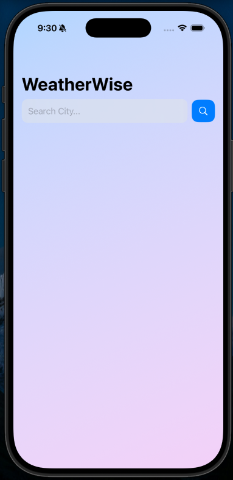
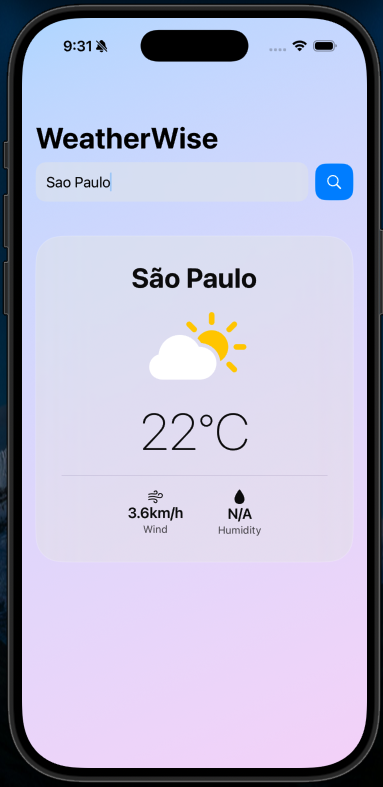

## Overview
Weather App is a straightforward iOS application that allows users to search for real-time weather conditions by city name. It is designed for everyday users who need quick, reliable meteorological updates. The app solves the problem of clunky, ad-heavy weather applications by providing a minimal, clean interface. Main features include a search bar for global cities, dynamic geocoding, and a display of current temperature, wind speed, and weather condition icons.

## Screenshots

## Architecture (MVVM)

### Service Layer
The `WeatherService` handles all network operations. It performs a two-step process: first, calling the Geocoding API to convert a string city name into precise latitude and longitude coordinates. Second, it calls the Weather API using those coordinates to fetch the current temperature, wind speed, and weather codes, parsing the JSON into Swift models.

### ViewModels
The `WeatherViewModel` holds the UI state using `@Published` properties for search text, loading states, and error messages. It acts as the bridge, taking the user's input from the view, calling the `WeatherService`, and formatting the returned data so the View can observe and react to it.

### Views
- **WeatherView**: The main screen that contains a text field for city search and dynamically displays a glassmorphism card containing the weather data or an error message if the search fails.
- **WeatherStat**: A reusable subview component to standardize the layout of individual weather metrics (like wind and humidity) at the bottom of the weather card.

## How to Run
1. Clone the repo.
2. Open `WeatherApp.xcodeproj`.
3. Select a simulator or device running iOS 16.0+.
4. Run (Cmd + R).

## Biggest Challenge + Solution
The biggest challenge was chaining two asynchronous API requests together, as the primary weather API requires exact latitude and longitude rather than a city name. This was difficult because it introduced multiple potential failure points and nested asynchronous code that had to be handled cleanly. I solved this by isolating the geocoding request and the forecast request into their own private asynchronous functions within the service layer, and then calling them sequentially in a single main function using Swift's async/await concurrency model. Through this, I learned how much cleaner and more readable async/await is compared to older closure-based networking patterns.
